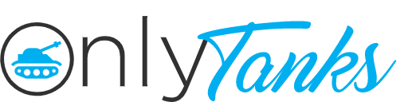

<h1 align="center">
  <br/>
</h1>
<p align="center"> 
  <p>Share your tank <b>pictures</b> around the world, <b>follow</b> other tank enthousiasts and <b>much more</b> with OnlyTanks. </p>
</p>

## 🧩 Components

Below is a list of our app components with link to their live versions. To deploy a new version of a component, refer to [DEPLOYMENTS.md](./DEPLOYMENTS.md)

| Component | Environment | Live URL                                                                    |
| --------- | ----------- | --------------------------------------------------------------------------- |
| Frontend  | Prod        | http://d2w3pepxe2h8ho.cloudfront.net                                        |
| Backend   | Prod        | http://onlytanksbackend-env.eba-w3ecpqtz.us-east-1.elasticbeanstalk.com/    |
| MongoDB   | Prod        | https://cloud.mongodb.com/v2/61e19a714dabab391e07e923                       |

⚠️ WARNING: Some ad blockers can block Sentry's API calls (for frontend monitoring). If you see blocked Sentry's calls in your network tab, you can disable your adblock, as a temporary workaround, and reload the app (https://github.com/getsentry/sentry-javascript/issues/2916).

## ⚡️ Quickstart

### 🐳 Using docker

A Docker setup is available using `docker-compose.yml` and the projects' `Dockerfile`.

With [Docker](https://docs.docker.com/get-docker/) and [docker-compose](https://docs.docker.com/compose/install/) installed:

```bash
# build and run the app
docker-compose -f docker-compose.yml up --build
```

### 🌐 Access the app

After running the app with Docker, the frontend will be served at `http://localhost:3000` and the backend at `http://localhost:8080`.

## 📆 Releases

Every release will have its own documentation where we will list completed features, our design choices and any other information related to the given release.

| Release   | Documentation file                  |
| --------- | ----------------------------------- |
| Release 1 | [RELEASE_1.md](./RELEASE_1.md)      |
| Release 2 | [RELEASE_2.md](./RELEASE_2.md)      |
| Release 3 | [RELEASE_3.md](./RELEASE_3.md)      |

## 👨‍🔬 Local development

### 💻 Running the components manually

To manually run both the frontend and backend of the app, refer to each project's README found in their respective directories ([frontend](frontend), [backend](backend)).

### 🐳 Using docker

A dev Docker setup is available using `docker-compose.dev.yaml` and the projects' `Dockerfile.dev`.

With [Docker](https://docs.docker.com/get-docker/) and [docker-compose](https://docs.docker.com/compose/install/) installed:

```bash
#install frontend dependencies
cd frontend
yarn

#install backend dependencies
cd backend
yarn

# build the app
docker-compose -f docker-compose.dev.yaml build

# run it
docker-compose -f docker-compose.dev.yaml up -d
```

Additionally, you can do both at the same time with `docker-compose -f docker-compose.dev.yaml up --build -d `.

For the production docker, only building and running `docker-compose.yml` is necessary.

### 🌐 Access the app

After running the app with Docker, the frontend will be served at `http://localhost:3000` and the backend at `http://localhost:8080`.

## 🧰 Development Stack

See [STACK.md](./STACK.md)

## 🍻 Prod break counter

- Laurent: 0
- Julien: 0
- Fran: 0
- Phil: 3
- Max: 1
- Toma: 0

## ⭐️ Contributors

- [Laurent Aubin](https://github.com/laurentaubin)
- [Francis Boulianne](https://github.com/francisboulianne)
- [Toma Gagné](https://github.com/tomagagne)
- [Maxime Miville-Deschênes](https://github.com/maximemvd)
- [Julien Suppiger](https://github.com/JulSupp)
- [Philippe Vincent](https://github.com/Philrobots)
